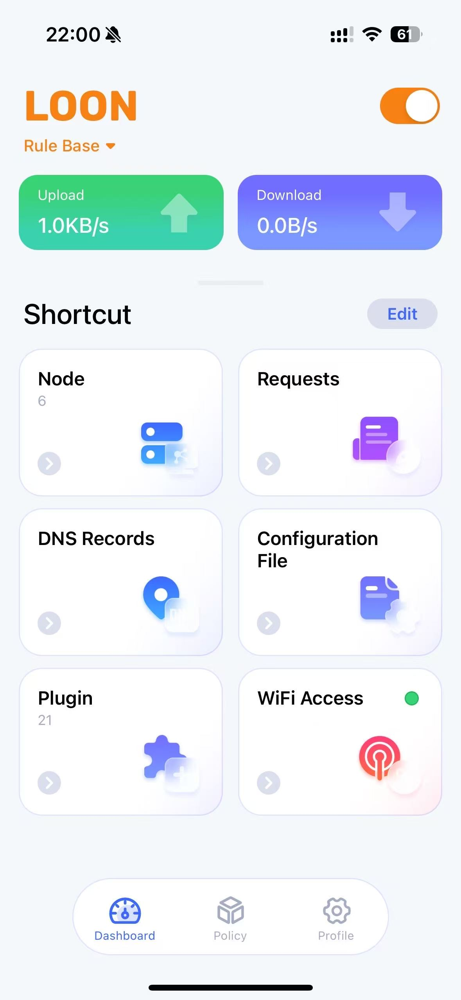
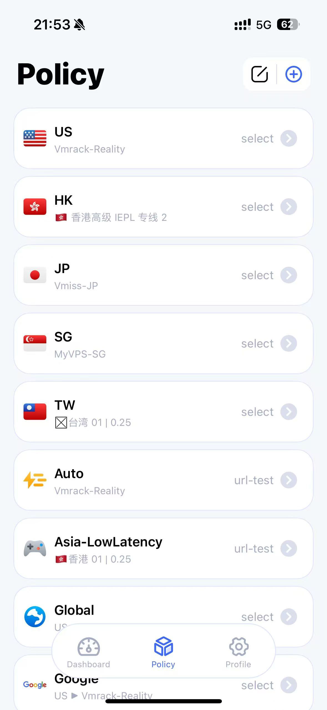
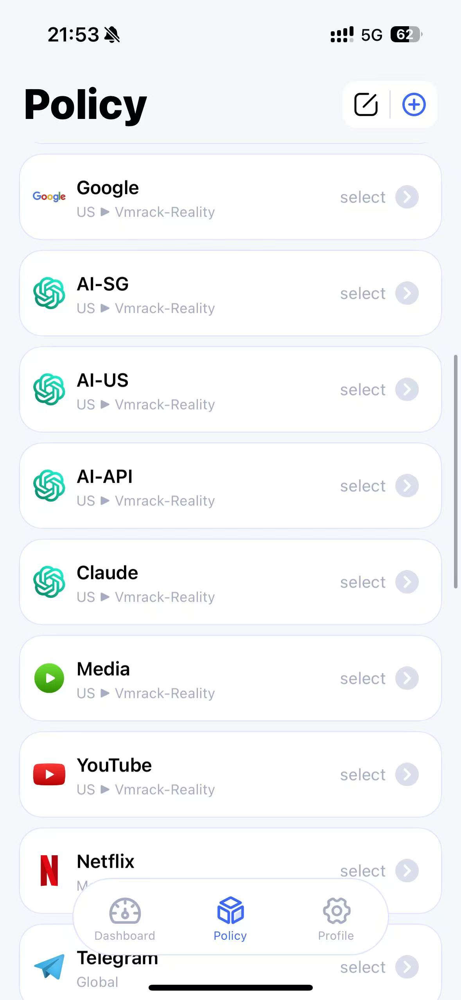
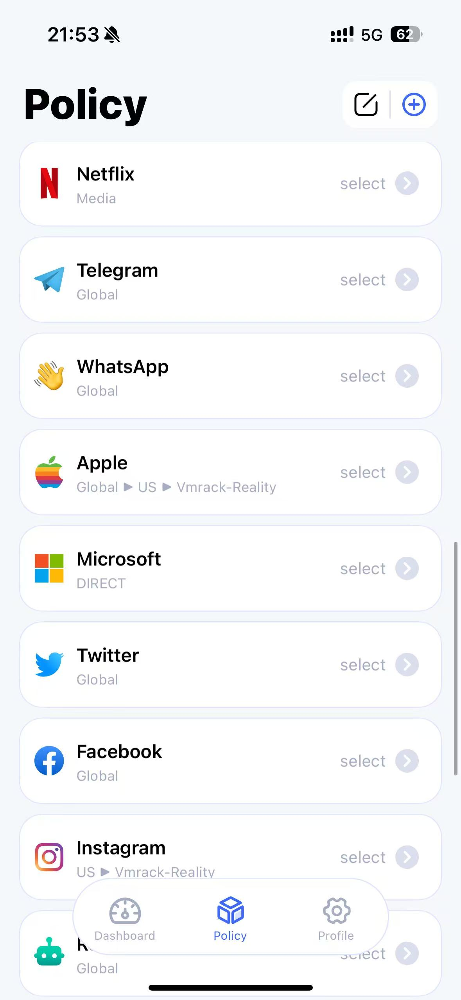
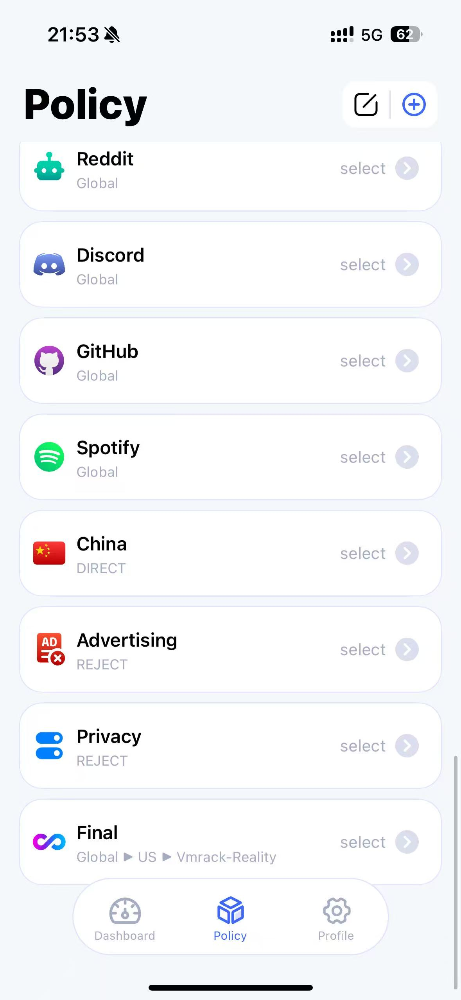
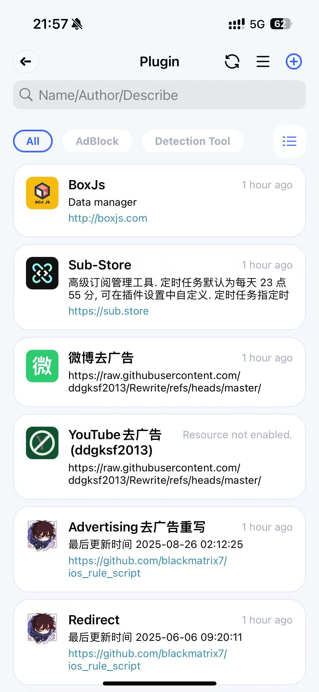
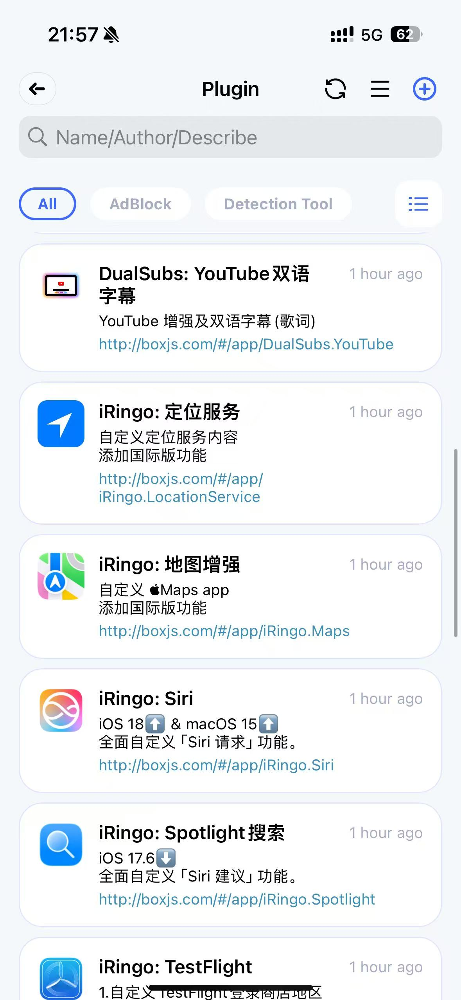
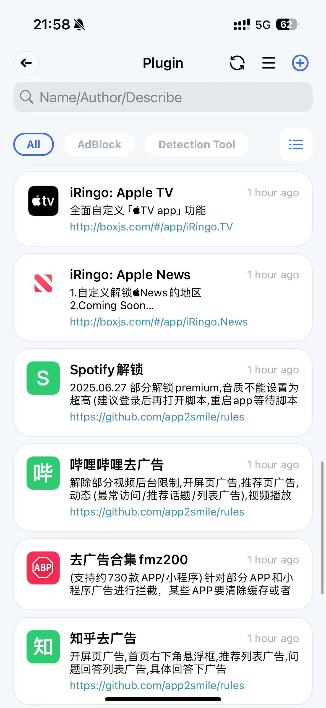
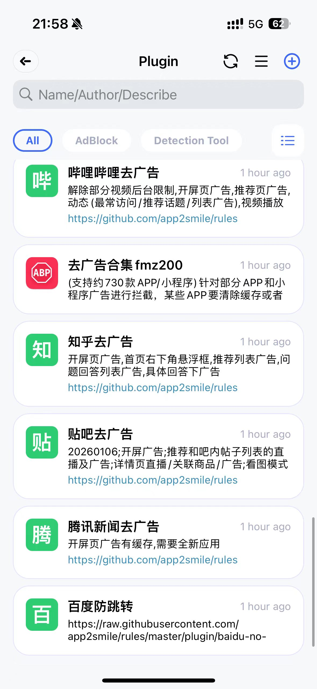

# loon-config

一份带详细注释、可直接读懂设计意图的 **Loon 配置**（iOS / iPadOS）。

主打：**国内直连、国外代理、不匹配也尽量直连**，附 AI 服务隔离、链式住宅 IP、分层去广告、流媒体/电竞优化。配置文件本身每个决策点都有中文注释，照着读就行；本 README 只讲整体设计与坑。

> ⚠️ **安全须知**：`loon.conf` 的 `[Proxy]` 段已**脱敏**，节点全是占位符。务必替换成你自己的，且**不要把真实密码 / UUID / 住宅代理账号提交到公开仓库**——GitHub 上有爬虫专扫代理凭证，几分钟内就会被盗用。

---

## 📱 预览（Loon / iOS 实机截图）

<p align="center">
  
</p>

<p align="center"><i>规则模式运行中 · 6 个节点 · 21 个插件 · 上下行实时统计</i></p>

## 设计哲学

> 能走中国的全走直连，剩下的走代理。国内用得多，所以默认偏向直连。

落实成规则就是一条**解析型 GEOIP 兜底**：

```
... 显式规则 ...
DOMAIN-SUFFIX,cn,China
GEOIP,CN,China,no-resolve   # 便宜：IP 形态请求先拦
GEOIP,CN,China              # 兜底：未命中域名解析后按 IP 归属，中国 IP 一律直连
FINAL,Final                 # 走到这 = 确认是国外的 → Global 代理
```

`no-resolve` 那条只能拦 IP 形态请求；**第二条不带 `no-resolve`** 才是关键——未命中的域名会被解析、按 IP 归属判定，国内 IP 直接直连，只有解析出非中国 IP 的才落到 `FINAL → Global`。这样「国内全直连、剩下走代理」才真正成立，而不是国内冷门站漏到代理变慢。

代价：这条早于远程广告列表，**国内 IP 上的部分广告会少拦**——靠下面的分层去广告补回来。

## 策略组一览

哲学落到策略组就是下面这套。可以直观看到：地区组 + 自动测速、AI 全系经 `Vmrack-Reality` 链式出口、`China = DIRECT`、`Advertising/Privacy = REJECT`、`Final` 兜底走 `Global→US→Vmrack-Reality`。

<table>
  <tr>
    <td></td>
    <td></td>
    <td></td>
    <td></td>
  </tr>
  <tr align="center">
    <td><sub>地区组 · Auto · 电竞低延迟</sub></td>
    <td><sub>Google · AI 系列 · Media · YouTube</sub></td>
    <td><sub>常用服务 · 社交（Apple/MS 直连）</sub></td>
    <td><sub>China 直连 · 广告拦截 · Final</sub></td>
  </tr>
</table>

## 去广告分三层（互不依赖路由）

1. **本地精准 REJECT 块**（`[Rule]` 最顶端）：穿山甲 / 优量汇 / 百度联盟 / 阿里妈妈等国内大广告联盟，只收「广告专用子域」，绝不碰内容主域。放最顶是为了压过 `qq.com/.cn→China` 和 GEOIP 兜底。
2. **远程广告列表**：blackmatrix7 `Advertising` / `Privacy`。
3. **MITM 重写插件**：fmz200 去广告合集（约 730 款 App，主力）+ app2smile 各 App + ddgksf2013 微博。**这层和路由无关**，直连也生效。

> 抖音去广告：本版**开启**（`[Mitm]` 未排除字节系主机，fmz200 可 MITM 抖音）。代价：抖音核心接口有证书锁定，MITM 偶发握手冲突，极端情况下抖音可能不稳/加载慢——这是「抖音去广告」的固有取舍。想要「抖音绝对稳但有广告」，把字节系主机加进 `[Mitm]` 的 `-` 强制排除即可。

### 已装插件实拍

去广告合集 fmz200 + app2smile 各 App（B站/知乎/贴吧/腾讯新闻/百度防跳转）+ ddgksf2013 微博 + blackmatrix7 Advertising 重写 + iRingo 系列 Apple 服务增强 + DualSubs 双语字幕 + YouTube Music 解锁 + Sub-Store/BoxJs：

<table>
  <tr>
    <td></td>
    <td></td>
    <td></td>
    <td></td>
  </tr>
  <tr align="center">
    <td><sub>BoxJs · Sub-Store · 微博 · 重写</sub></td>
    <td><sub>DualSubs · iRingo 系列</sub></td>
    <td><sub>解锁 · B站 · fmz200 合集</sub></td>
    <td><sub>知乎 · 贴吧 · 腾讯新闻 · 百度</sub></td>
  </tr>
</table>

## 其它要点

- **DNS**：阿里公共 DNS 打头 + DoH（阿里 / dnspod / 360），不优先吃运营商 DNS。
- **AI 隔离**：OpenAI/Claude/Gemini/Grok/DeepSeek 分别走不同出口；Claude/AI-API 经**链式住宅 IP**（设备→VPS→住宅代理→目标），对 AI 风控更友好。
- **QUIC**：YouTube 定点封 UDP 443 强制走 TCP，否则 MITM 去广告失效。
- **TikTok vs 抖音**：只收 TikTok 专用域名走代理；抖音那套 `snssdk/pstatp/bytedance` 走直连，注意 `isnssdk≠snssdk`、`ipstatp≠pstatp` 这类 i/sg 前缀变体，互不冲突。
- **WhatsApp**：已删 3 条超宽 AWS 网段（`/12`、`/15`），那是 WhatsApp 早年跑 AWS 的遗留，会误吞无关流量；现靠域名规则足够。

## 节点配置放哪里 ——「自建 VPS」和「机场订阅」位置不一样 ⚠️

这是最容易填错的地方。两者在配置里是**两个不同的段**，别填混：

### ① 自建 VPS / 单条节点 → `[Proxy]` 段

手动一行一个节点，自己机器/朋友的服务器就填这里。本仓库已脱敏成占位符，照格式替换：

```ini
[Proxy]
# Trojan：  名称 = Trojan,你的域名,端口,"密码",transport=tcp,sni=你的域名
MyVPS-SG = Trojan,your.domain.com,8443,"YOUR_PASSWORD",transport=tcp,sni=your.domain.com
# VLESS-Reality：public-key/short-id 由服务端给出
Vmrack-Reality = VLESS,your.domain.com,8443,"YOUR_UUID",transport=tcp,flow=xtls-rprx-vision,public-key="YOUR_KEY",short-id=YOUR_SHORT_ID,udp=true,over-tls=true,sni=www.sony.com
```

### ② 机场订阅链接 → `[Remote Proxy]` 段（**不是** `[Proxy]`）

机场给的是一个**订阅 URL**，不是单条节点。填到 `[Remote Proxy]`，并把 `enabled=false` 改成 `true`：

```ini
[Remote Proxy]
机场1 = https://你的机场订阅地址,udp=true,block-quic=true,fast-open=true,enabled=true
```

> 一句话区分：**一条条手写的服务器 → `[Proxy]`；一个网址拉一堆节点 → `[Remote Proxy]`。** 填反了 Loon 解析不出节点，策略组会空。机场节点经 `[Remote Filter]` 自动按地区（US/HK/JP/SG/TW）筛进对应策略组，无需手动加。

## 使用步骤

1. 按上面 ①②，把 `[Proxy]` 占位符换成你的自建节点，机场订阅填 `[Remote Proxy]` 并 `enabled=true`（两个都没有就只用得到直连/规则部分）。
2. Loon 导入 `loon.conf`（或从 [Releases](../../releases) 直接下载最新版配置文件）。
3. 去广告/增强需 **开启 MITM 并安装信任 CA 证书**；部分 App 要清缓存或重装才生效。
4. 想改抖音去广告/稳定性取舍，见上文「去广告分三层」。

## 致谢

本配置站在社区肩膀上，规则 / 脚本 / 插件 / 图标均来自以下开源项目，按用途列出：

**分流规则 & 去广告**
- [blackmatrix7 / ios_rule_script](https://github.com/blackmatrix7/ios_rule_script) —— 分流规则列表 + Advertising/Redirect 去广告重写
- [fmz200 / wool_scripts（奶思）](https://github.com/fmz200/wool_scripts) —— 去广告合集（约 730 款 App，主力）
- [app2smile / rules](https://github.com/app2smile/rules) —— B站/知乎/贴吧/腾讯新闻去广告、百度防跳转、YouTube Music 解锁
- [ddgksf2013 / Rewrite](https://github.com/ddgksf2013/Rewrite) —— 微博去广告

**App 增强 & 脚本**
- [NSRingo（iRingo）](https://github.com/NSRingo) —— Apple 服务国际化增强：定位 / 地图 / Siri / Spotlight / TestFlight / Apple TV / Apple News
- [DualSubs](https://github.com/DualSubs) —— YouTube 双语字幕（含歌词）
- [Maasea / sgmodule](https://github.com/Maasea/sgmodule) —— YouTube / YouTube Music 去广告与后台播放脚本

**工具 & 数据**
- [Peng-YM / Sub-Store](https://github.com/Peng-YM/Sub-Store) —— 订阅管理
- [chavyleung / scripts（BoxJs）](https://github.com/chavyleung/scripts) —— 持久化数据管理
- [Hackl0us / GeoIP2-CN](https://github.com/Hackl0us/GeoIP2-CN) —— GEOIP CN 库（解析型兜底依赖它）
- [Koolson / Qure](https://github.com/Koolson/Qure) —— 策略组图标

感谢以上作者的持续维护。如有遗漏请提 Issue 补充。

## 免责声明

仅供个人学习与网络优化研究。节点/订阅/破解类插件（如 Spotify 解锁）请自行评估合规与封号风险，与本仓库无关。
